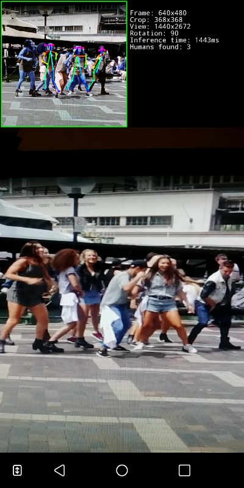
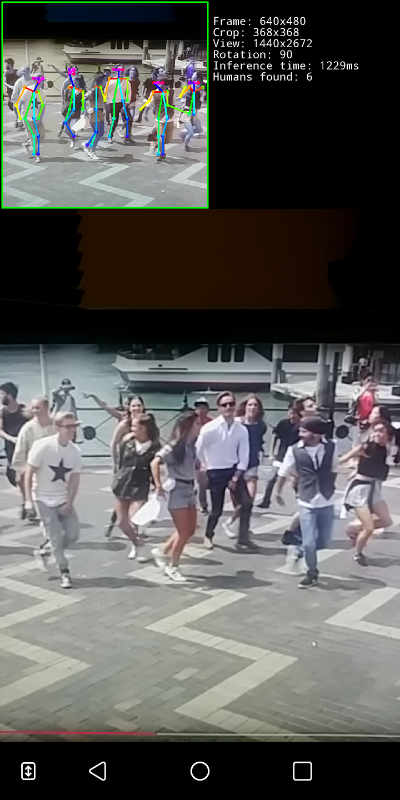
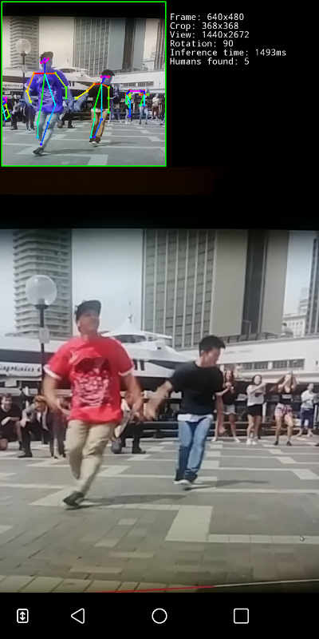

# OpenPose Android Demo

Testing running the OpenPose inference model on Android device with [TensorFlow Lite](https://www.tensorflow.org/lite).

- I migrate all python code (includign dependencies) to Java
- Based on 'TensorFlow Android Camera Demo'
- Inference model converter to TFLite using convert.py

Based on a Tensorflow + Python implementation https://github.com/ildoonet/tf-pose-estimation at commit [0031b4e](https://github.com/ildoonet/tf-pose-estimation/tree/0031b4e7fd312f561cc73b9289fd6d36af59db4a)

The original OpenPose implementation can be found on https://github.com/CMU-Perceptual-Computing-Lab/openpose

  

## Licence

Copyright 2019 Ricardo Tejo

Licensed under the Apache License, Version 2.0 (the "License");
you may not use this file except in compliance with the License.
You may obtain a copy of the License at

    http://www.apache.org/licenses/LICENSE-2.0

Unless required by applicable law or agreed to in writing, software
distributed under the License is distributed on an "AS IS" BASIS,
WITHOUT WARRANTIES OR CONDITIONS OF ANY KIND, either express or implied.
See the License for the specific language governing permissions and
limitations under the License.